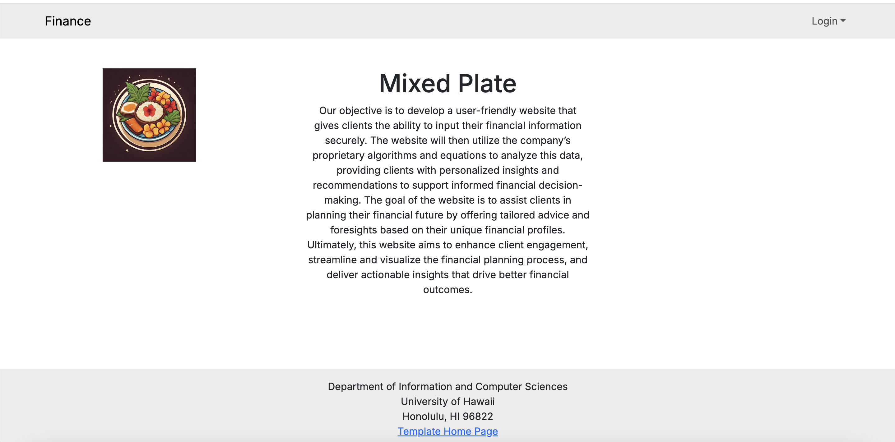
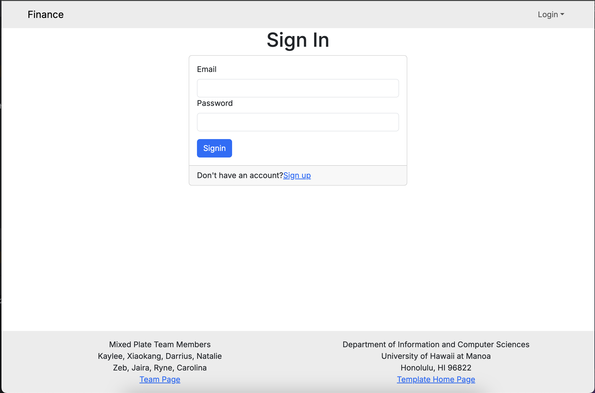
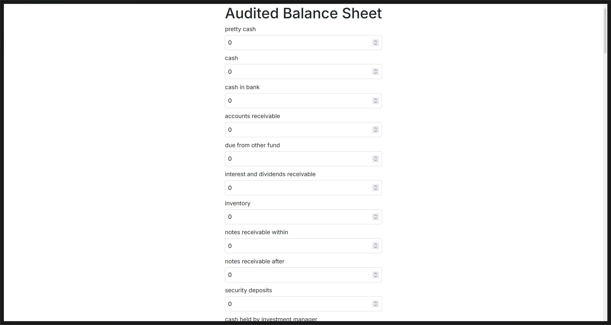
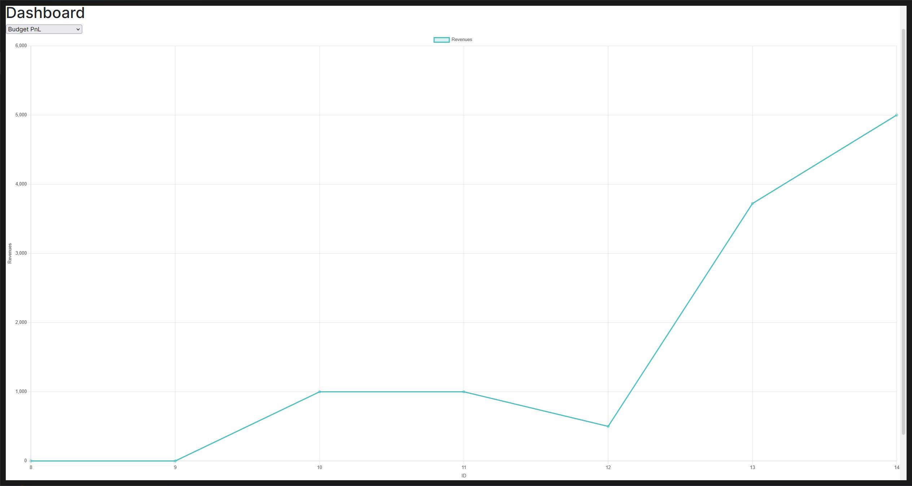
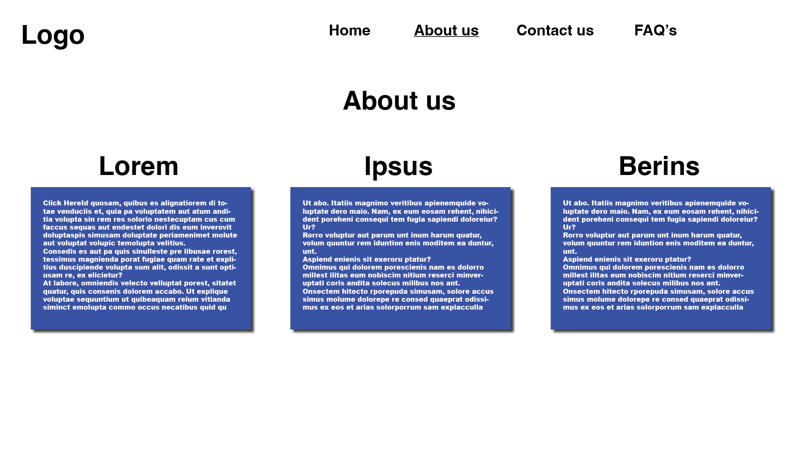
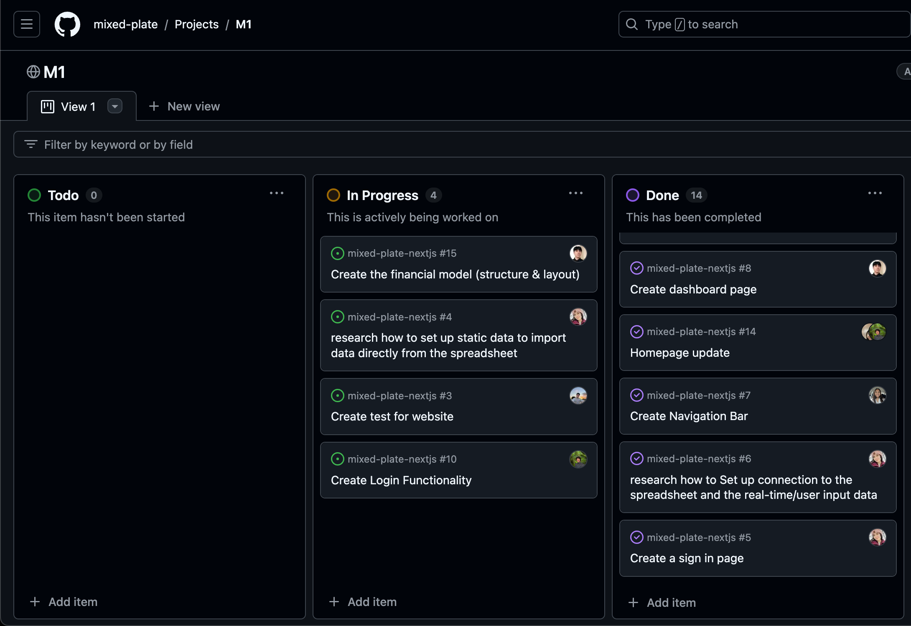

# Mixed Plate

## Table of contents
* [Overview](#overview)
* [Team](#team)
* [Mock-up Pages](#mock-up-pages)
* [Development History](#development-history)

## Overview
Our objective is to develop a user-friendly website that gives clients the ability to input their financial information securely. The website will then utilize the company's proprietary algorithms and equations to analyze this data, providing clients with personalized insights and recommendations to support informed financial decision-making. The goal of the website is to assist clients in planning their financial future by offering tailored advice and foresights based on their unique financial profiles. Ultimately, this website aims to enhance client engagement, streamline and visualize the financial planning process, and deliver actionable insights that drive better financial outcomes.

## Team
* [Kaylee Agorilla](https://kayleeagorilla.github.io/)
* [Xiaokang Chen](https://xiaokchenedu.github.io/)
* [Darrius Dacquel](https://darriusdacquel.github.io/)
* [Natalie Dang](https://ndang562.github.io/)
* [Zeb Lakey](https://zeb1283.github.io/)
* [Jaira Pader](https://jairabp.github.io/)
* [Ryne Stagen](https://senyr.github.io/)
* [Carolina Taylor](https://carolinataylor.github.io/)

### Links
* [Team Contract](https://docs.google.com/document/d/1RjQpE1v-KnegEi_WD4V4ywFx8YryvBxxtOvXPAtF67U/edit?usp=sharing)
* [GitHub Organization](https://github.com/mixed-plate)

## Mock-up Pages
### Landing

The Landing page is presented to users when they visit the top-level URL to the site, and includes a brief description of Mixed Plate. This page is shown if a user is not logged in.

### Login Page

The Login page is where users can enter their login credentials to access the rest of the site like the Input and Dashboard pages. This page is shown if a user is not logged in. 
 
### Input Page

The Input page is where users and companies are able to enter their financial data, which is then processed and stored into the database. This page is only accessible to users who are logged in.

### Dashboard Page

The Dashboard page is where financial input and computed data are displayed as charts for visualization. This is where users will be directed to after logging in.

### About Us Page

The About us page will display any information about the company and include contact information. This page will be accessible to all users whether they are logged in or not.

## Development History
<h4>Milestone 1: Mock up Development</h4>
Our goal for Milestone 1 was to create a team contract and negotiate what roles and tasks each team member would be assigned. We then created a simple UI for the landing, input, sign in, and dashboard page. In addition, we decided to use the Next.js template for our project. 
Since we still have a few issues still in our To-Do and In-Progress tab of our M1 project board, we plan to backlog and move those issues to our M2 milestone. 

Milestone 1 was managed using [Mixed-Plate GitHub Project Board M1](https://github.com/orgs/mixed-plate/projects/2)

