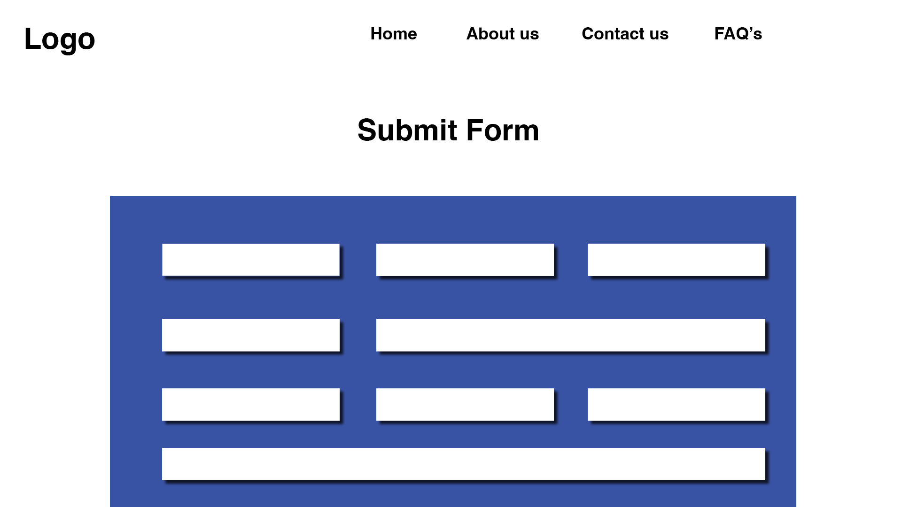

# Mixed Plate

## Table of contents
* [Overview](#overview)
* [Team](#team)
* [Mock-up Pages](#mock-up-pages)
* [Developer Guide](#developer-guide)
* [Development History](#development-history)

## Overview
Our objective is to develop a user-friendly website that gives clients the ability to input their financial information securely. The website will then utilize the company's proprietary algorithms and equations to analyze this data, providing clients with personalized insights and recommendations to support informed financial decision-making. The goal of the website is to assist clients in planning their financial future by offering tailored advice and foresights based on their unique financial profiles. Ultimately, this website aims to enhance client engagement, streamline and visualize the financial planning process, and deliver actionable insights that drive better financial outcomes.

## Team
* Kaylee Agorilla
* Xiaokang Chen
* Darrius Dacquel
* Natalie Dang
* Zeb Lakey
* Jaira Pader
* Ryne Stagen
* Carolina Taylor

### Team Contract
* [Team Contract](https://docs.google.com/document/d/1RjQpE1v-KnegEi_WD4V4ywFx8YryvBxxtOvXPAtF67U/edit?usp=sharing)
* [GitHub Organization](https://github.com/mixed-plate)

## Mock-up Pages
 ## Home Page
 

 
 
 ## Form Page 
  

 
 
 ## About Us Page
  

 

## Developer Guide
WIP

## Development History
<h4>Milestone 1: Mock up Development</h4>
WIP
<h4>Milestone 2: Deployment</h4>
WIP
<h4>Milestone 3: </h4>
WIP
