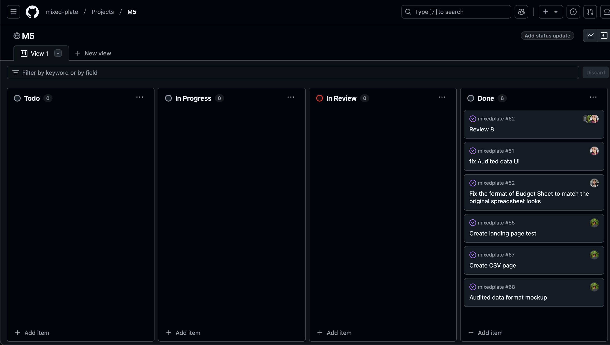

# Mixed Plate

## Table of contents
* [Overview](#overview)
* [Team](#team)
* [Mock-up Pages](#mock-up-pages)
* [Development History](#development-history)

## Overview
Our objective is to develop a user-friendly website that gives clients the ability to input their financial information securely. The website will then utilize the company's proprietary algorithms and equations to analyze this data, providing clients with personalized insights and recommendations to support informed financial decision-making. The goal of the website is to assist clients in planning their financial future by offering tailored advice and foresights based on their unique financial profiles. Ultimately, this website aims to enhance client engagement, streamline and visualize the financial planning process, and deliver actionable insights that drive better financial outcomes.

## Team
* [Kaylee Agorilla](https://kayleeagorilla.github.io/)
* [Xiaokang Chen](https://xiaokchenedu.github.io/)
* [Darrius Dacquel](https://darriusdacquel.github.io/)
* [Natalie Dang](https://ndang562.github.io/)
* [Zeb Lakey](https://zeb1283.github.io/)
* [Jaira Pader](https://jairabp.github.io/)
* [Carolina Taylor](https://carolinataylor.github.io/)

### Links
* [Team Contract](https://docs.google.com/document/d/1RjQpE1v-KnegEi_WD4V4ywFx8YryvBxxtOvXPAtF67U/edit?usp=sharing)
* [GitHub Organization](https://github.com/mixed-plate)

## Mock-up Pages
### Home Page

The Home Page is presented to users when they visit the top-level URL to the site and includes a brief description of Spire and their purpose. This page is shown if a user is not logged in.

### Sign In Page

The Sign In page is where users can enter their login credentials to access the rest of the site. Depending on their given role, they have certain functionalities and can only access parts of the site that they have permission for. This page is shown if a user is not logged in yet. 

### Sign Up Page

The Sign Up Page is 
 
### Input Page

The Input page is where users and companies are able to enter their financial data, which is then processed and stored into the database. This page is only accessible to users who are logged in.

### Dashboard Page

The Dashboard page is where financial input and computed data are displayed as charts for visualization. This is where users will be directed to after logging in.

### About Us Page

The About us page will display any information about the company and include contact information. This page will be accessible to all users whether they are logged in or not.

## Development History
<h4>Milestone 1</h4>
Our goal for Milestone 1 was to create a team contract and negotiate what roles and tasks each team member would be assigned. We then created a simple UI for the landing, input, sign in, and dashboard page. In addition, we decided to use the Next.js template for our project. Since we still have a few issues still in our To-Do and In-Progress tab of our M1 project board, we plan to backlog and move those issues to our M2 milestone. 

Milestone 1 was managed using [Mixed-Plate GitHub Project Board M1](https://github.com/orgs/mixed-plate/projects/2)

<h4>Milestone 2: Customer Milestone 1</h4>
Our goal for Milestone 2 was to improve our existing UI and set up a way to input the audited balance sheet for cash and cash equivalents. We also created acceptance testing for our project. In addition, we reviewed different files and code to determine what needed to be updated or removed. 

Milestone 2 was managed using [Mixed-Plate GitHub Project Board M2](https://github.com/orgs/mixed-plate/projects/9)

<h4>Milestone 3</h4>
Our goal for Milestone 3 was to create a simple mock up for the forms page while removing any default values for the budget and audited data. We also continued to add any missing items into the audited balance sheet database. Lastly, we implemented continuous integration for our project which provides a badge that displays our project's build status.

Milestone 3 was managed using [Mixed-Plate GitHub Project Board M3](https://github.com/orgs/mixed-plate/projects/11/views/1)

<h4>Milestone 4: Customer Milestone 2</h4>
Our goal for Milestone 4 was to add more roles to our project and assigning certain functions for the different roles. We wanted to heavily improve the audited balance sheet by implementing a total feature for each category and fix the UI of the form to match the original spreadsheet look. We then created an admin panel and improved the UI for the home page. Along with all of this, we continued to review different files to see what needed to be updated.

Milestone 4 was managed using [Mixed-Plate GitHub Project Board M4](https://github.com/orgs/mixed-plate/projects/16/views/1)

<h4>Milestone 5</h4>
Our goal for Milestone 5 was to fix a bunch of our existing code and clean most of it up. We fixed the audited data UI and the format of the budget sheet so that it matched the look of the original spreadsheet. We then created a mockup pages for the audited data format and also for a CSV page. The CSV page allows authorized users to upload CSV files and have it input the data for them.

Milestone 5 is being managed using [Mixed-Plate GitHub Project Board M5](https://github.com/orgs/mixed-plate/projects/17/views/1)

